# Product API Sequence Diagrams

This document contains sequence diagrams showing the request flow for different scenarios in the Product Catalog API.

## 1. Successful Product Retrieval (HTTP 200)

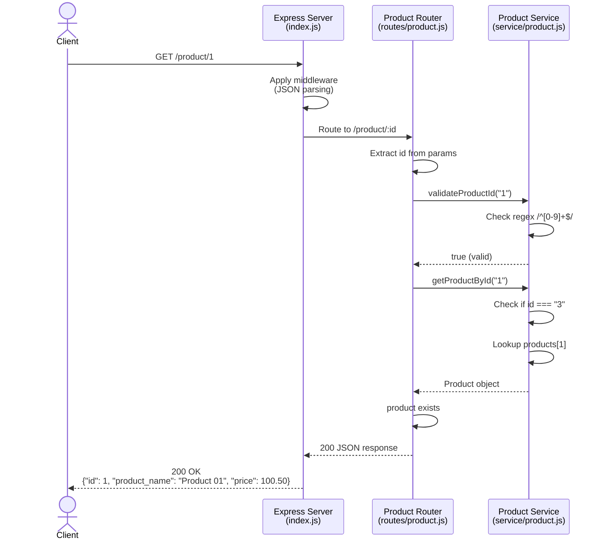

## 2. Product Not Found (HTTP 404)

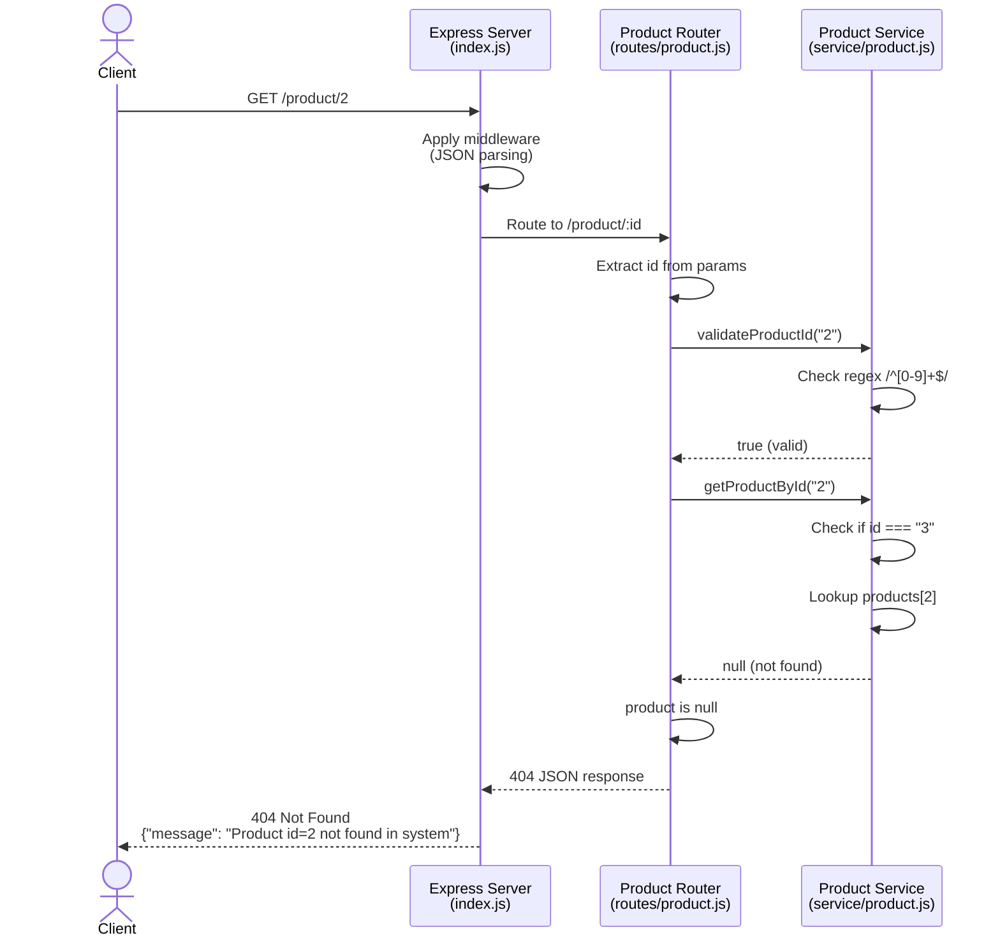

## 3. System Error (HTTP 500)

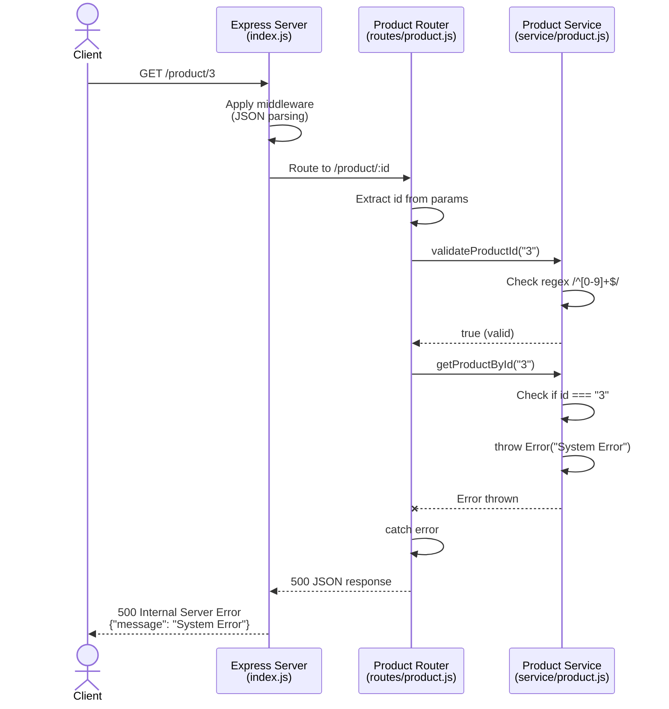

## 4. Invalid Input - Validation Error (HTTP 400)

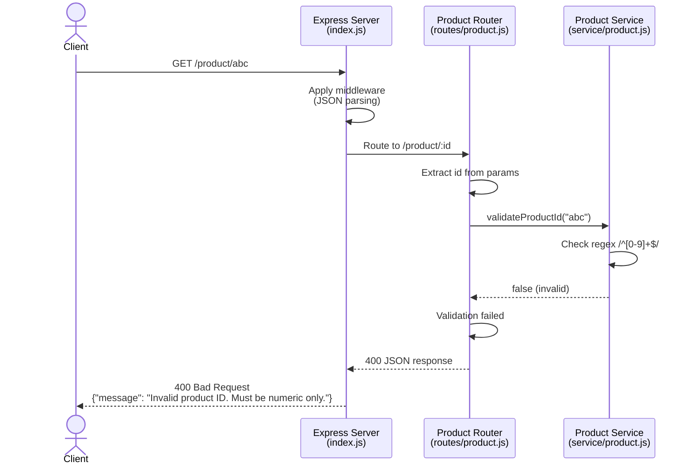

## 5. Security - SQL Injection Attempt (HTTP 400)

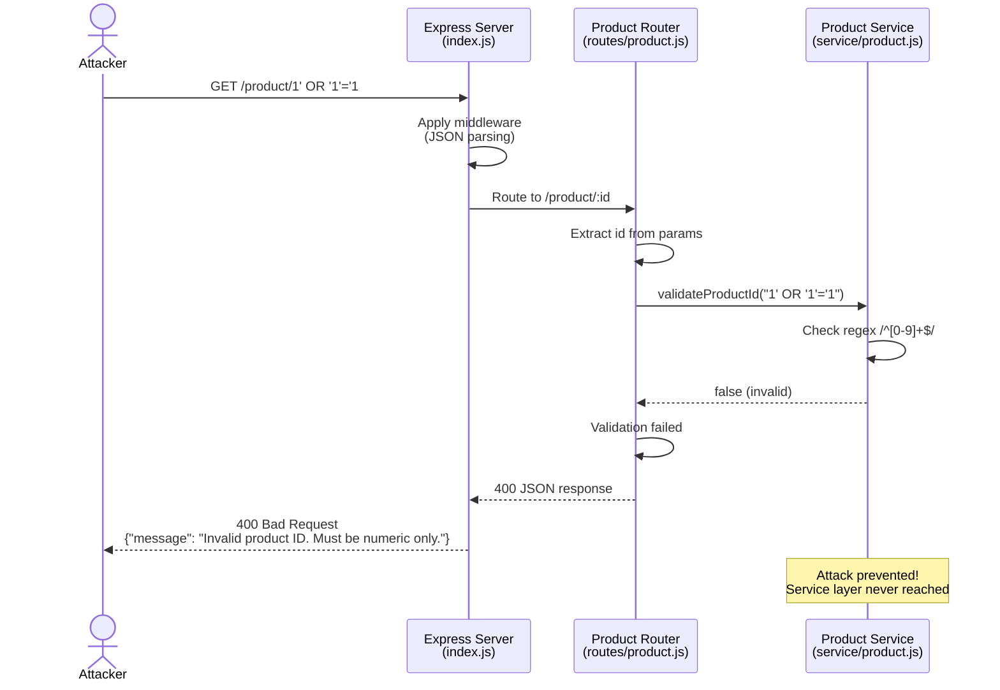

## 6. Health Check Endpoint

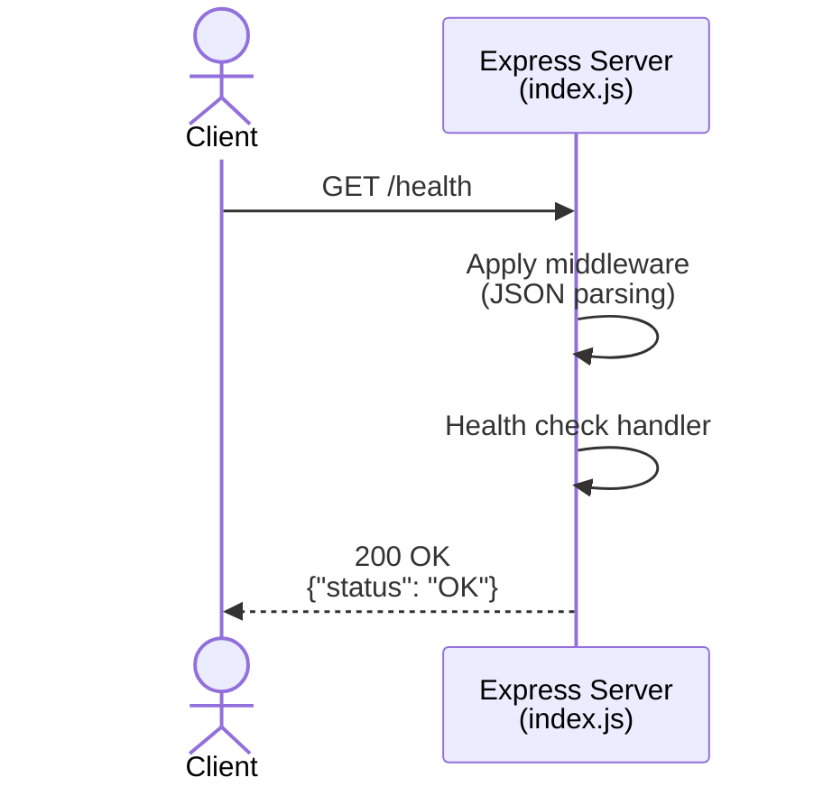

## 7. Unknown Endpoint (HTTP 404)

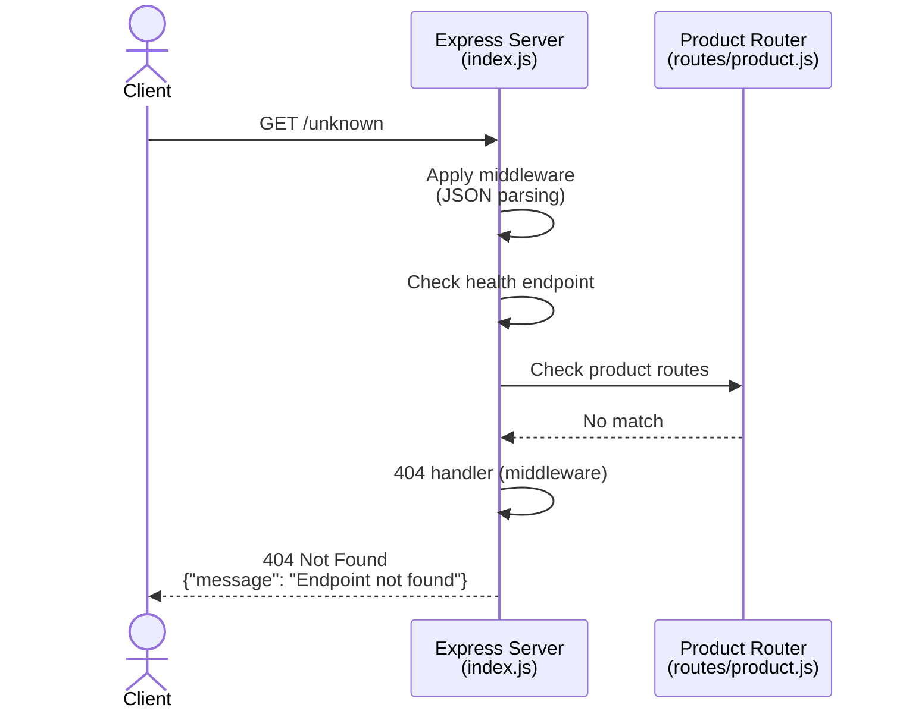

## Architecture Flow Summary

### Request Processing Pipeline

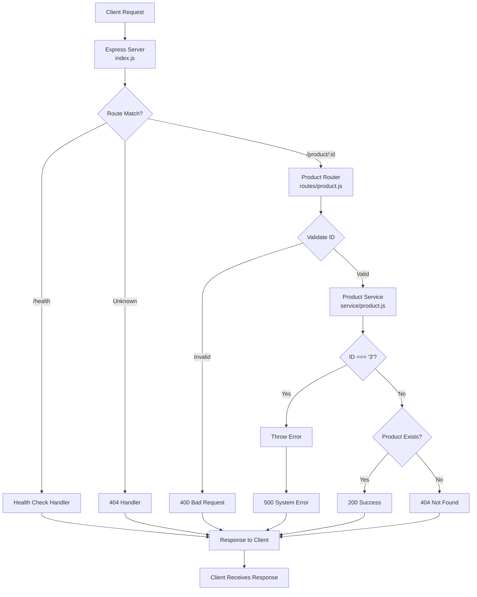

### Component Interaction

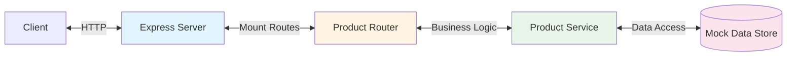

## Testing Flow

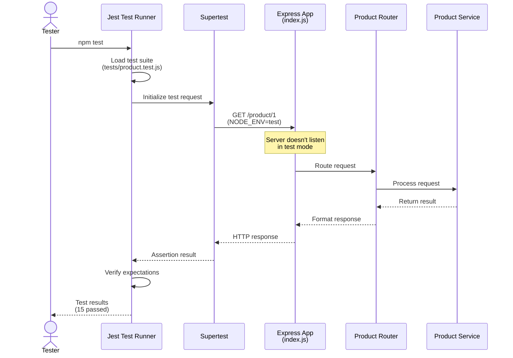

## Error Handling Flow

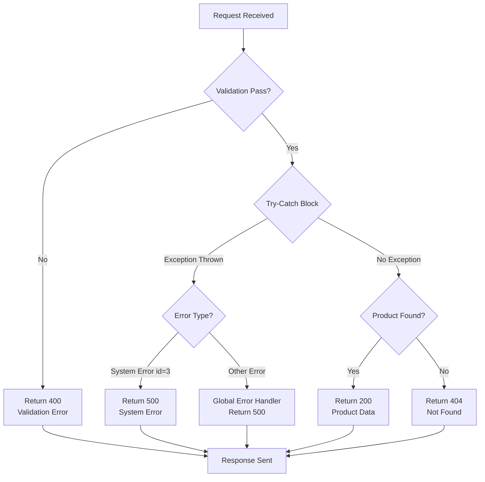
